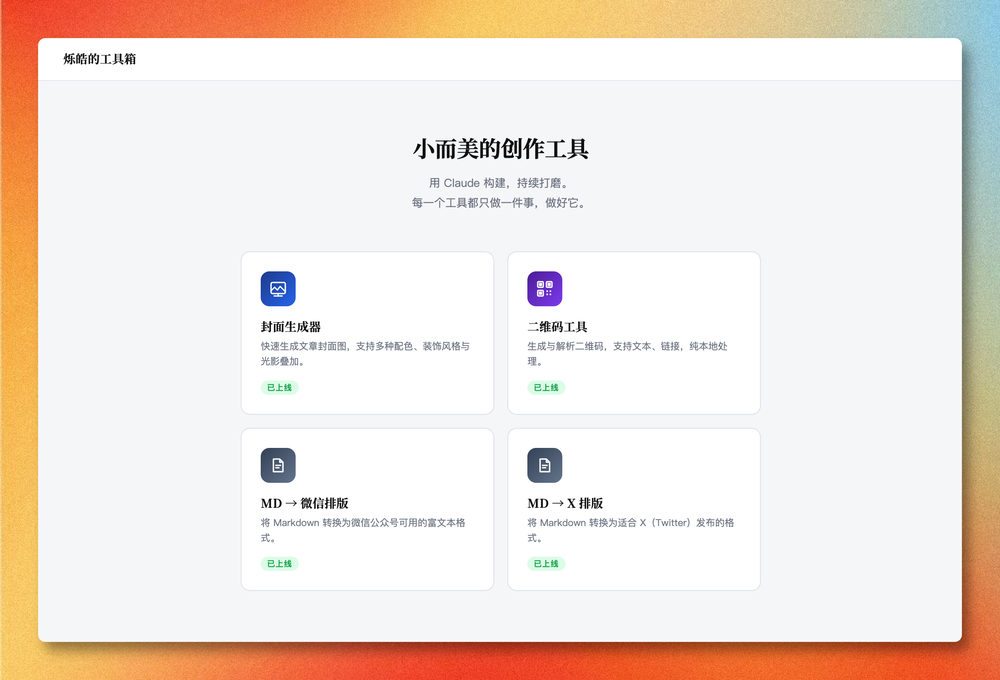
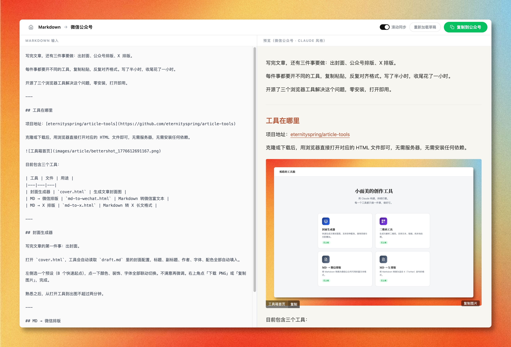
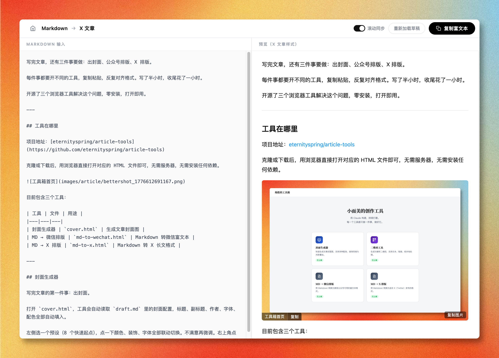

类型：文章
选题：开源写作工具箱介绍
生成时间：2026-04-20

```json
"changes": {
  "background": {
    "type": "scheme",
    "index": 1,
    "name": "翡翠"
  },
  "content": {
    "label": "烁皓的开源工具",
    "title": "开源了我的写作三件套：封面生成 + 公众号排版 + X 排版",
    "subtitle": "专注写作，其他的交给工具",
    "author": "@eternityspring · 烁皓"
  },
  "typography": {
    "labelSize": 2.7,
    "titleSize": 5.3,
    "subtitleSize": 3.1,
    "contentWidth": 77
  }
}
```

## 正文

写完文章，还有三件事要做：出封面、公众号排版、X 排版。

每件事都要开不同的工具，复制粘贴，反复对齐格式。写了半小时，收尾花了一小时。

我开源了三个浏览器工具解决这个问题，零安装，打开即用。

---

## 工具在哪里

项目地址：[https://github.com/eternityspring/article-tools](https://github.com/eternityspring/article-tools)

克隆或下载后，启动个web服务就能访问。无需安装任何依赖。



目前包含三个工具：

| 工具 | 文件 | 用途 |
|---|---|---|
| 封面生成器 | `cover.html` | 生成文章封面图 |
| MD → 微信排版 | `md-to-wechat.html` | Markdown 转微信富文本 |
| MD → X 排版 | `md-to-x.html` | Markdown 转 X 长文格式 |

---

## 封面生成器

写完文章的第一件事：出封面。

打开 `cover.html`，工具会自动读取 `draft.md` 里的封面配置，标题、副标题、作者、字体、配色全部自动填入。

左侧选一个预设（8 个快速起点），点一下颜色、装饰、字体全部联动切换。不满意再微调。右上角点「下载 PNG」或「复制图片」，完成。

熟悉之后，从打开工具到出图不超过两分钟。


---

## MD → 微信排版

Markdown 写完，直接粘贴到微信公众号编辑器，格式全乱。

打开 `md-to-wechat.html`，工具会自动读取 `draft.md` 里的文章内容，右侧实时预览微信样式。点「复制富文本」，直接粘贴进公众号编辑器，格式完整保留。

支持标题、正文、引用块、代码块、加粗、列表，覆盖日常写作的全部需求。



---

## MD → X 排版

在 X 发长文，换行和格式是大问题。

打开 `md-to-x.html`，工具会自动读取 `draft.md` 里的文章内容，右侧按 X 的排版规则实时渲染：段落间距、粗体保留、代码块转纯文本。复制后直接粘贴发布。

注意：X 不支持代码块，所以代码块会转成纯文本。x也不会自动上传图片。所以需要点击图片上的复制按钮，手动到x文章编辑器中粘贴。



---

## 完整工作流

```
写 draft.md
  ↓
cover.html → 封面图（下载 / 复制）
  ↓
md-to-wechat.html → 复制富文本 → 粘贴公众号
  ↓
md-to-x.html → 复制内容 → 粘贴 X
```

三个工具独立，按需取用。全部基于本地文件，没有账号，没有服务器，不联网。

---

## 最后

所有代码都在单个 HTML 文件里，可以让你的Agent按照自己的需求编排优化。

这个工具是独立的，每次写完内容，可以做一个归档.skill 直接把草稿和封面图一起归档到你指定的位置。

---
*运行 /score 评分 | 修改满意后运行 /archive 存档*
